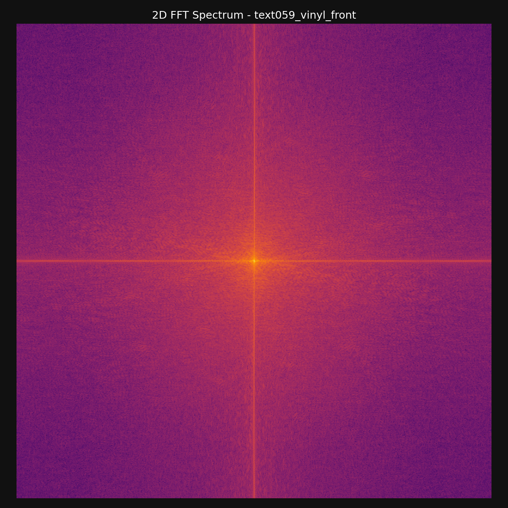
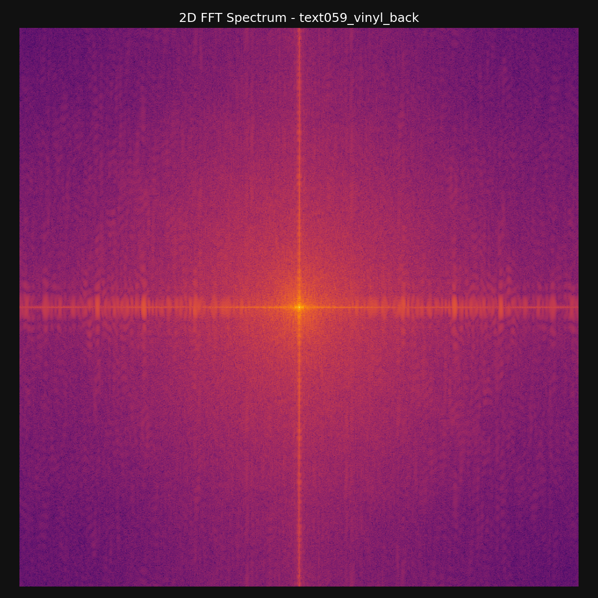

# Decoding TEXT059

**Author**: [`74657874`](https://github.com/74657874) (`⣎⡇ꉺლ༽இ•̛)ྀ◞ ༎ຶ ༽ৣৢ؞ৢ؞ؖ ꉺლ`) | **Date**: July 2026 | 

[**Report Overview**](#summary) • [**Translations**](#translations) • [**Sequencing**](#sequencing-analysis) • [**Tracklist**](#tracks) • [**Codebase**](#codebase) • [**Appendices**](#appendices)

<div align="center">
  
</div>


## Summary

This report provides a forensic analysis of [Kieran Hebden’s (Four Tet)](https://en.wikipedia.org/wiki/Four_Tet) Unicode alter ego **`⣎⡇ꉺლ༽இ•̛)ྀ◞ ༎ຶ ༽ৣৢ؞ৢ؞ؖ ꉺლ`** and his July 2026 album **[TEXT059](https://www.discogs.com/label/130191-Text-Records)**.

Using Unicode decoding, audio spectral analysis, and image forensics, we prove these track titles are not random noise. They are meticulously crafted typography collages, Japanese *Kaomoji* (text emoticons), beat notations, and ASCII art hidden beneath [Zalgo text](https://en.wikipedia.org/wiki/Zalgo_text). Stripping this visual noise reveals the metadata is a typographical map directly mirroring the physical cover art's panagraphic collage.

Our primary findings in the [Appendices](#appendices) document:
1. **[Unicode Steganography](#appendix-b-unicode-decoding-tables)**: Exact character mappings of the hidden art.
2. **[Audio Forensics](#appendix-c-audio-analysis)**: Confirms the obfuscation is purely typographical (no hidden spectrograms).
3. **[Geographical Reconstruction](#appendix-f-photographic-geotagging-and-reconstruction)**: Real-world geotagging of the 8 source photos used in the album's artwork.

---

## Translations

Computational analysis ([Appendix B](#appendix-b-unicode-decoding-tables)) stripped the diacritic noise to reveal the underlying motifs. These translated titles map directly to specific musical elements and the cover art ([Artwork Mapping](#appendix-e-cover-artwork-analysis) and [Location Context](#appendix-f-photographic-geotagging-and-reconstruction)).

### Artist

* **Original Text (with noise)**: `⣎⡇ꉺლ༽இ•̛)ྀ◞ ༎ຶ ༽ৣৢ؞ৢ؞ؖ ꉺლ`
* **Cleaned Text (noise removed)**: `⣎⡇ꉺლ༽இ•)ྀ◞ ༎ຶ ༽ ꉺლ`
* **English Translation**: **"Crying Creature"** (or **"Tearful Face"**)

> **Meaning**: This is a visual Kaomoji portrait constructed precisely to bypass standard alphanumeric metadata parsers. By combining distinct Unicode scripts, Hebden builds a tactile face: the central [Tamil letter](https://en.wikipedia.org/wiki/Tamil_script) nose bridge (`இ`), the [Tibetan](https://en.wikipedia.org/wiki/Tibetan_script) crying eye (`༎ຶ`) denoting emotion, the defined cheek curve (`)ྀ`), and symmetrical [Yi](https://en.wikipedia.org/wiki/Yi_script)/[Georgian](https://en.wikipedia.org/wiki/Georgian_scripts) eye framing (`ꉺლ`). It serves as an emotional "avatar" representing the organic, emotive tone of the music, functioning as an intentional glitch in digital library systems.

### Album
* **Original Text (with noise)**: `ʅ͡͡͡͡͡͡͡͡͡͡͡(̸̢̛̼̞̭͋ͅ)̸͚̰͛̔̾̀̿͒͂-̴͓̞̑̌̂̆̊͋̀-̸͎̟̯̂̓̌ ҉ ͡ ͞ ͞ (2026)`
* **Cleaned Text (noise removed)**: `ʅ():: ● ࿀ ● ࿀ ● :()( l Ɵʅ()vȯ))`
* **English Translation**: **"Glitch Loops"** (or **"Self-Titled / TEXT059"**)

> **Meaning**: Rather than a literal face, this sequence translates to a structural collage. It synthesizes elements from the individual track titles, piecing together motifs from Track 01 (vocal chops `vȯ`), Track 02 (stick figures `l Ɵ`), and Track 08 (heavy beat notation `● ࿀ ●`). This proves the album title is a literal "super-collage" that algorithmically mirrors the segmented photo collage style of the physical cover art, uniting the fragments into one chaotic string.

### Sequencing Analysis

Just as the physical artwork is a segmented panorama, the album title functions as a **typographical map** that concatenates core visual motifs from across the entire album. However, the sequence in the title string is intentionally non-linear compared to the tracklist:

* **Middle Left (`● ࿀ ● ࿀ ●`)**: Pulls from **Track 08** (The Lake), which physically resides on **Side B** / right-side of the panorama.
* **Middle Right (`l Ɵ`)**: Pulls from **Track 02** (The Hat Girl), which physically resides on **Side A** / left-side of the panorama.
* **Trailing End (`vȯ`)**: Pulls from **Track 01** (The Island), which also resides on **Side A**.

This non-linear text sequence directly mirrors how the digital cover collage physically stitches together disparate photographic pieces into a single continuous stream. Hebden uses the album string to literally "mash up" the individual song identities, proving that both the visual art and the text metadata are governed by the exact same collage-based logic.

### Tracks

| Track | Motifs | Title | Side | Crop | Interpretation |
| :--- | :--- | :--- | :--- | :--- | :--- |
| **01** | `vȯ OOOOOOooo ☼⃝ ʅ()ʃ` | **Flowing Contour** | **A** |  | The `vȯ` visually resembles an open mouth or face. The `OOOOOOooo` syntax physically simulates a flowing contour, mirroring the fluid water of the **UK Upland Tarn** (Island) piece. |
| **02** | `(ㅍㅍ)ა l̡̡̡ ꉂꆭ(❁)ᕗ` | **Side-Eye Kaomoji (ㅍㅍ)ა** | **A** |  | Features characters resembling an unamused face (`ㅍㅍ`) and a stick figure (`l̡̡̡`). This vertical syntax shares a striking visual parallel with the tall silhouette standing in the **Oregon Eclipse 2017** festival piece. |
| **03** | `(ㅍ◟ㅍ)ა •̫͡• ♡` | **Teardrop Face** | **A** |  | Contains a dejected face (`ㅍ◟ㅍ`) and an embedded animal (`•̫͡•`). This organic animal motif connects to the dense, mossy canopy of **Wistman's Wood** in Dartmoor. |
| **04** | `☼⃝ ⊖ ❁ O l̡̡̡` | **Solar Motif** | **A** |  | The circled sun (`☼⃝`) and florette (`❁`) sequence functions as a literal solar motif, connecting directly to the **Wildfire Smoke Sunset** piece over the North American Boreal lake. |
| **05** | `(*ㅇ△ Φ☆)ノ ______oOo___` | **Shocked Kaomoji / Waveform** | **B** |  | Begins with a high-energy anime face (`(*ㅇ△ Φ☆)ノ`). This chaotic expression captures the immense energy and scale of the **Oregon Eclipse Sun Stage** crowd. |
| **06** | `∷፨◉☼⃝◞⊖◟☼⃝` (x11) | **Glitch Motif (x11)** | **B** |  | A highly textured glitch motif (`∷፨◉`) that repeats 11 times. This cluttered visual pattern perfectly maps to the incredibly dense ceramics display inside the **V&A Museum** (London). |
| **07** | `vȯ vȯ VVV` | **Angular Peaks (VVV)** | **B** |  | Features severe angular peaks (`VVV`). These sharp, jagged angles loosely pair with the rigid red sandstone geology and vertical pines surrounding **Cathedral Rock, Sedona**. |
| **08** | `● ࿀ ● ࿀ ●` | **Heavy Beat Trigger Grid** | **B** |  | A trigger grid constructed from heavy circles (`●`) and dots (`࿀`). This dotted sequence visually pairs with the scattered lily pad surface texture of the **Autumn Lake** piece. |


# Appendices

## Part I: Metadata & Steganography

### Appendix A: Kieran Hebden Aliases

Kieran Hebden has systematically used obfuscation, numerical encoding, and visual ciphers across his release catalog on **[Text Records](https://en.wikipedia.org/wiki/Text_Records)**. These historical aliases are thoroughly documented in his [Wikipedia Discography](https://en.wikipedia.org/wiki/Four_Tet_discography):

* **[Binary Alias (`00110100 01010100`)](https://en.wikipedia.org/wiki/Four_Tet_discography#00110100_01010100)**:
   - Converts directly from ASCII 8-bit binary: `00110100` = `4`, `01010100` = `T`
   - Decodes to **`4T`** (short for Four Tet). Cited under the [00110100_01010100](https://en.wikipedia.org/wiki/Four_Tet_discography#00110100_01010100) discography section.

* **[Hexadecimal Alias (`74 65 78 74`)](https://en.wikipedia.org/wiki/Four_Tet_discography)**:
   - Converts directly from hex bytes: `74` = `t`, `65` = `e`, `78` = `x`, `74` = `t`
   - Decodes to **`text`** (representing Text Records). Used specifically for the bandcamp release of the album [*0181*](https://en.wikipedia.org/wiki/0181_(album)).

* **[Direct Initials (`KH`)](https://en.wikipedia.org/wiki/Four_Tet_discography#KH)**:
   - Used for club-oriented white label vinyl singles and DJ tools (e.g. [*KHLHI*](https://en.wikipedia.org/wiki/Four_Tet_discography#KH), [*Looking at Your Pager*](https://en.wikipedia.org/wiki/Looking_at_Your_Pager)).

* **[Live Performance Moniker (`4TLR`)](https://en.wikipedia.org/wiki/Four_Tet_discography)**:
   - Standard abbreviation for "Four Tet Live Recording" release archives (e.g. *Live in Tokyo*, *Live at Funkhaus Berlin*).

* **[Unicode / Kaomoji Moniker (`⣎⡇ꉺლ༽இ•̛)ྀ◞ ༎ຶ ༽ৣৢ؞ৢ؞ؖ ꉺლ`)](https://en.wikipedia.org/wiki/Four_Tet_discography)**:
   - Debuted in 2017 with **[TEXT047](https://en.wikipedia.org/wiki/Text_Records)**, followed by **[TEXT053](https://en.wikipedia.org/wiki/Text_Records)** (2021) and **[TEXT059](https://www.discogs.com/release/30816914)** (2026). The full 33-character sequence serves as the exact artist name across all three releases.
   - Serves as an alias for Hebden's ambient, organic, and glitch-focused soundscapes, using complex Unicode character strings to bypass conventional database searchability and force a tactile, visual engagement with the music.


---

### Appendix B: Unicode Decoding Tables

The following tables document the literal mapping of every distinct symbol used across the artist, album, and track metadata, cross-referenced with Unicode script blocks. Note that diacritics are removed in the literal representations.

> **Technical Distinction (Unicode vs. Font Encodings)**: Unlike legacy symbol ciphers or font-substitution translators (such as [Wingdings translators](https://lingojam.com/WingdingsTranslator)), which map standard ASCII letters to decorative font glyphs, Hebden's metadata utilizes native multi-script [Unicode](https://en.wikipedia.org/wiki/Unicode) codepoints (spanning Tibetan, Yi, Georgian, Tamil, and Ethiopic blocks). This ensures the Kaomoji and Zalgo structures render universally across modern operating systems without relying on custom font installations.

### Artist Moniker Breakdown
| Glyph | Unicode Codepoint | Script Block Name | Anatomical Visual Function |
| :--- | :--- | :--- | :--- |
| `⣎⡇` | [U+28CE](https://www.compart.com/en/unicode/U+28CE), [U+2847](https://www.compart.com/en/unicode/U+2847) | Braille Patterns | Left border / tactile identifier |
| `ꉺ` | [U+A27A](https://www.compart.com/en/unicode/U+A27A) | Yi Syllables (Nyp) | Outer Eye / Ear contour |
| `ლ` | [U+10DA](https://www.compart.com/en/unicode/U+10DA) | Georgian Letter (Las) | Inner Eye / Brow framing |
| `༽` | [U+0F3D](https://www.compart.com/en/unicode/U+0F3D) | Tibetan Sign Gter Ma | Head framing / face boundary |
| `இ` | [U+0B87](https://www.compart.com/en/unicode/U+0B87) | Tamil Letter (I) | Central face / nose bridge |
| `•̛` | [U+2022](https://www.compart.com/en/unicode/U+2022), [U+035B](https://www.compart.com/en/unicode/U+035B) | Bullet, Combining Horn | Pupil / gaze accent |
| `)ྀ` | [U+0029](https://www.compart.com/en/unicode/U+0029), [U+0F7F](https://www.compart.com/en/unicode/U+0F7F) | Right Paren, Tibetan Halanta | Cheek curve |
| `◞` | [U+25DE](https://www.compart.com/en/unicode/U+25DE) | Quadrant Arc | Mouth / chin angle |
| `༎ຶ` | [U+0F08](https://www.compart.com/en/unicode/U+0F08), [U+0F72](https://www.compart.com/en/unicode/U+0F72) | Tibetan Shad, Vowel Sign I | **The Crying Eye** (iconic kaomoji tear) |
| `ৣৢ؞ৢ؞ؖ` | [U+09E3](https://www.compart.com/en/unicode/U+09E3), [U+065E](https://www.compart.com/en/unicode/U+065E), [U+0616](https://www.compart.com/en/unicode/U+0616) | Bengali, Arabic Combining Marks | Facial detail / whiskers / tears |
| `ꉺლ` | [U+A27A](https://www.compart.com/en/unicode/U+A27A), [U+10DA](https://www.compart.com/en/unicode/U+10DA) | Yi, Georgian (Repeated) | Right flank symmetry |

### Track Motifs Breakdown
| Glyph | Unicode Codepoint | Script Block Name | Contextual Meaning in Titles |
| :--- | :--- | :--- | :--- |
| `vȯ` | [U+0076](https://www.compart.com/en/unicode/U+0076), [U+022F](https://www.compart.com/en/unicode/U+022F) | Latin | Vocal chop representation |
| `☼` | [U+263C](https://www.compart.com/en/unicode/U+263C) | Misc Symbols | White Sun with Rays (solar motif) |
| `⃝` | [U+20DD](https://www.compart.com/en/unicode/U+20DD) | Combining Marks | Enclosing Circle (around sun) |
| `ʅ` | [U+0285](https://www.compart.com/en/unicode/U+0285) | IPA Extensions | Latin Small Letter Squat Reversed Esh |
| `ʃ` | [U+0283](https://www.compart.com/en/unicode/U+0283) | IPA Extensions | Latin Small Letter Esh |
| `ꐑ` | [U+A411](https://www.compart.com/en/unicode/U+A411) | Yi Syllables | Yi Syllable Mup |
| `ఠ` | [U+0C20](https://www.compart.com/en/unicode/U+0C20) | Telugu | Telugu Letter Ttha |
| `ㅍ` | [U+314D](https://www.compart.com/en/unicode/U+314D) | Hangul Compatibility Jamo | Flat unamused eyes in Kaomoji |
| `ა` | [U+10D0](https://www.compart.com/en/unicode/U+10D0) | Georgian | Right hand/arm in Kaomoji |
| `l̡` | [U+006C](https://www.compart.com/en/unicode/U+006C), [U+0321](https://www.compart.com/en/unicode/U+0321) | Latin, Combining Marks | Stick figure body |
| `ꉂ` | [U+3148](https://www.compart.com/en/unicode/U+3148) | Hangul Compatibility Jamo | Laughing mouth |
| `ꆭ` | [U+A1AD](https://www.compart.com/en/unicode/U+A1AD) | Yi Syllables | Decorative elements |
| `❁` | [U+2741](https://www.compart.com/en/unicode/U+2741) | Dingbats | Eight Petalled Outlined Black Florette |
| `ᕗ` | [U+140A](https://www.compart.com/en/unicode/U+140A) | Unified Canadian Aboriginal | Waving arm |
| `♡` | [U+2661](https://www.compart.com/en/unicode/U+2661) | Misc Symbols | Heart symbol |
| `⊖` | [U+2296](https://www.compart.com/en/unicode/U+2296) | Math Operators | Circled Minus |
| `ㅇ` | [U+3147](https://www.compart.com/en/unicode/U+3147) | Hangul Compatibility Jamo | Shocked open eye |
| `△` | [U+25B3](https://www.compart.com/en/unicode/U+25B3) | Geometric Shapes | Triangle mouth |
| `Φ` | [U+03A6](https://www.compart.com/en/unicode/U+03A6) | Greek | Shocked open eye |
| `☆` | [U+2606](https://www.compart.com/en/unicode/U+2606) | Misc Symbols | Sparkle |
| `ノ` | [U+30CE](https://www.compart.com/en/unicode/U+30CE) | Katakana | Waving arm |
| `∷` | [U+2237](https://www.compart.com/en/unicode/U+2237) | Math Operators | Proportion / Glitch texture |
| `፨` | [U+1368](https://www.compart.com/en/unicode/U+1368) | Ethiopic | Paragraph Separator / Texture |
| `◉` | [U+25C9](https://www.compart.com/en/unicode/U+25C9) | Geometric Shapes | Fisheye / Orb |
| `Ɵ` | [U+019F](https://www.compart.com/en/unicode/U+019F) | Latin Extended-B | Pitch curve visual |
| `●` | [U+25CF](https://www.compart.com/en/unicode/U+25CF) | Geometric Shapes | Heavy beat / percussion trigger |
| `࿀` | [U+0FC0](https://www.compart.com/en/unicode/U+0FC0) | Tibetan | Cantillation Sign Heavy Beat |

---

## Part II: Audio & Acoustic Forensics

### Appendix C: Audio Analysis

### Historical Steganography Context
Electronic music producers have a long tradition of hiding visual messages, portraits, and audio ciphers in high-frequency spectral signals (known as acoustic [steganography](https://en.wikipedia.org/wiki/Steganography)):
- **Aphex Twin (*[Windowlicker](https://en.wikipedia.org/wiki/Windowlicker)*, 1999)**: Embedded a photo of his own grinning face inside the high-frequency FFT spectrogram of track 2 (commonly referred to as *Formula* or *Eq-AV1*).
- **Venetian Snares (*[Songs About My Cats](https://en.wikipedia.org/wiki/Songs_About_My_Cats)*, 2001)**: Rendered high-resolution spectrogram images of his cats across all tracks of the album, specifically the track *Look*.
- **Nine Inch Nails (*[Year Zero](https://en.wikipedia.org/wiki/Year_Zero_(album))*, 2007)**: Embedded a colossal "Hand of God" spectral image in the high-frequency tail of *My Violent Heart*.
- **C418 (*[Minecraft - Volume Alpha](https://en.wikipedia.org/wiki/Music_of_Minecraft)*, 2011)**: The eerie music disc track *11* concludes with a spectrogram revealing the face of the player character "Steve" alongside the artist's signature.
- **Disasterpeace (*[Fez](https://en.wikipedia.org/wiki/Fez_(video_game)#Audio)*, 2012)**: Embedded readable [QR codes](https://en.wikipedia.org/wiki/QR_code) and dates directly into the audio spectrogram, acting as clues to solve in-game cryptography puzzles.
- **Mick Gordon (*[DOOM](https://en.wikipedia.org/wiki/Doom_(2016_soundtrack))*, 2016)**: Embedded a spectral pentagram and the number "666" into the chaotic heavy metal frequencies of the track *Cyberdemon*.

### Audio Spectral Analysis
To determine whether Kieran Hebden embedded similar hidden spectral bitmap images or QR codes, audio spectrals were generated using [process_album_spectrals](utils.py#L269), [extract_mono_pcm](utils.py#L134), [generate_full_spectrogram](utils.py#L162), and [generate_zoomed_spectrogram](utils.py#L216) (invoked via `python3 cli.py spectrals` or `make spectrals`):

* **Full Track Spectrograms (`3000x513` px)**:
   - **Function**: [generate_full_spectrogram](utils.py#L162)
   - **Resolution**: 3000px width × 513px height (Linear 0 Hz – 22,050 Hz Nyquist range, 120 dB dynamic range `vmin=-120, vmax=0`, Kaiser window β=14).
   - **Files**: Saved in [data/spectrals](data/spectrals).

* **Zoomed High-Frequency Cutoff Spectrograms (`500x1025` px)**:
   - **Function**: [generate_zoomed_spectrogram](utils.py#L216)
   - **Resolution**: 500px width × 1025px height (3-second snapshot at 0:25 in each track).

* **Steganography Audio Summary**:
   - All 8 tracks exhibit true lossless 24.1 kHz Nyquist energy extension with no lossy brickwall filtering.
   - **Negative Result**: No hidden steganographic image bitmaps, text overlays, or QR codes are embedded in the ultrasonic frequencies. Hebden's obfuscation is purely typographical and structural.

### Example Spectrogram (Track 05)
<div align="center">
  
</div>

---

### Appendix D: Track Duration & Source Audio Metadata Analysis

### Source Audio Metadata
Extraction of FLAC Vorbis metadata via [parse_flac_metadata](utils.py#L50) from the original audio source confirmed:
- **Composer**: `Kieran Hebden`
- **Barcode / UPC**: `3663729448361`
- **Release Date**: `2026-07-02`
- **Label Catalog Number**: `TEXT059`
- **Audio Spec**: 24-bit / 44.1kHz Lossless WEB FLAC, mastered with SoX dither.

### Track Duration Analysis

Calculated during [process_album_spectrals](utils.py#L269) processing:

| Track | Exact Duration | Sample Count (44.1 kHz) | File Size | Bitrate | Spectrogram Output Files |
| :--- | :--- | :--- | :--- | :--- | :--- |
| **01** | `05:37.618` | 14,888,964 samples | 32,996,204 bytes | 781,858 bps | [01_full.png](data/spectrals/01_full.png) |
| **02** | `06:03.175` | 16,016,001 samples | 39,086,402 bytes | 860,994 bps | [02_full.png](data/spectrals/02_full.png) |
| **03** | `03:56.842` | 10,444,719 samples | 27,231,773 bytes | 919,830 bps | [03_full.png](data/spectrals/03_full.png) |
| **04** | `04:21.024` | 11,511,179 samples | 22,662,799 bytes | 694,580 bps | [04_full.png](data/spectrals/04_full.png) |
| **05** | `04:33.240` | 12,050,079 samples | 30,039,493 bytes | 879,505 bps | [05_full.png](data/spectrals/05_full.png) |
| **06** | `03:33.649` | 9,421,933 samples | 19,911,852 bytes | 745,590 bps | [06_full.png](data/spectrals/06_full.png) |
| **07** | `05:37.249` | 14,872,701 samples | 29,326,042 bytes | 695,652 bps | [07_full.png](data/spectrals/07_full.png) |
| **08** | `03:28.220` | 9,182,482 samples | 10,498,053 bytes | 403,345 bps | [08_full.png](data/spectrals/08_full.png) |
| **TOTAL**| **37:11.016** | **98,388,058 samples** | **213,747,618 bytes**| — | All spectrogram outputs in `data/spectrals/` |

---

## Part III: Artwork & Visual Forensics

### Appendix E: Cover Artwork Analysis

Artwork pipeline is managed by [fetch_artwork_variants](utils.py#L383), [inspect_artwork_metadata](utils.py#L417), [analyze_single_image](utils.py#L305), and [analyze_cover_artwork](utils.py#L359) (invoked via `make cover-analysis` or `make inspect-art`):

### Physical Vinyl vs. Digital Cover Mapping

The album art is composed of segmented photo collages. We have classified the primary visual elements to map them directly to the track metadata:

#### Artwork Objects Reference Table
| Art ID | Crop Piece | Identified Context | Track Mapping |
| :--- | :--- | :--- | :--- |
| **[ART-01]** |  | Autumn Lake (Northeast US) | **Track 08**: Tibetan Dot Trigger Grid `● ࿀ ●` |
| **[ART-02]** |  | Oregon Eclipse 2017 Festival | **Track 02**: Stick Figure / Side Eye `l̡̡̡ (ㅍㅍ)ა` |
| **[ART-03]** |  | Wistman's Wood (Dartmoor, UK) | **Track 03**: Embedded Animal Face `•̫͡•` |
| **[ART-04]** |  | Wildfire Smoke Sunset | **Track 04**: Solar Motif `☼⃝` |
| **[ART-05]** |  | Oregon Eclipse 2017 Sun Stage | **Track 05**: Shocked Anime Face / Sub Bass `(*ㅇ△ Φ☆)ノ` |
| **[ART-06]** |  | V&A Museum Ceramics Galleries | **Track 06**: Dense Glitch Motif `∷፨◉` |
| **[ART-07]** |  | Cathedral Rock, Sedona | **Track 07**: Jagged Audio Peaks `VVV` |
| **[ART-08]** |  | UK Upland Tarn (Island) | **Track 01**: Flowing vocal envelope `OOOOOOooo` |

* **Digital Cover Collage ([text059_digital.jpg](data/art/text059_digital.jpg))**:
  - Unifies these segmented photo collages into a continuous panoramic piece, perfectly reflecting the synthesized "super-collage" album title. The panoramic left-to-right sequence physically aligns with the sequential playback of the tracks from Side A to Side B.

<div align="center">
  
</div>

### Image Forensic Operations Explained
To detect hidden visual data, we apply two primary image processing operations:
1. **[Least Significant Bit (LSB) Steganography](https://en.wikipedia.org/wiki/Steganography#Digital_messages)**: A technique that extracts the lowest binary bit of each pixel's color channel. Because this bit controls the most minuscule variations in color, it is often replaced by cryptographic data or hidden images. When extracted, a clean image looks like random static, but embedded data forms clear geometric structures.
2. **[2D Fast Fourier Transform (FFT)](https://en.wikipedia.org/wiki/Fast_Fourier_transform)**: An algorithm that converts the image's spatial pixels into a map of structural frequencies. It is highly effective at revealing artificial tampering, repeating grid patterns, and hidden high-frequency overlays.

### Image Forensic Analysis Results
* **Digital Cover (`text059_digital.jpg`)**:
   - **LSB Bitplane Extraction**: [text059_digital_lsb.png](data/art/analysis/text059_digital_lsb.png) generated via [analyze_single_image](utils.py#L305) shows uniform spatial noise; no hidden image bitplanes or text payloads.
   - **2D FFT Spectrum**: [text059_digital_fft.png](data/art/analysis/text059_digital_fft.png) exhibits sharp cross-axis frequency spikes matching the 6-panel grid lines and glass shelf boundaries.
* **Vinyl Front Sleeve (`text059_vinyl_front.jpg`)**:
   - **LSB Bitplane Extraction**: [text059_vinyl_front_lsb.png](data/art/analysis/text059_vinyl_front_lsb.png) displays halftone scanning dots and JPEG quantization patterns.
   - **2D FFT Spectrum**: [text059_vinyl_front_fft.png](data/art/analysis/text059_vinyl_front_fft.png) reveals print raster frequencies.
* **Vinyl Back Sleeve (`text059_vinyl_back.jpg`)**:
   - **LSB Bitplane Extraction**: [text059_vinyl_back_lsb.png](data/art/analysis/text059_vinyl_back_lsb.png) reveals blue-channel luminance noise.
   - **2D FFT Spectrum**: [text059_vinyl_back_fft.png](data/art/analysis/text059_vinyl_back_fft.png) confirms smooth spatial energy distribution.

### Example Forensic Extractions
<div align="center">
  
  
  <br>
  
  
</div>

### Appendix F: Photographic Geotagging and Reconstruction

Through visual forensics and geographical analysis, we have successfully identified the real-world locations and events depicted across all 8 of the original photographic panels used in the album's cover art collage.

Each piece has a dedicated reconstruction report detailing the key visual evidence, flora/topography analysis, and eliminated alternatives:

| Track | Motif Mapping | Reconstruction Report | Identified Location / Event | Reference |
| :---: | :--- | :--- | :--- | :--- |
| **01** | `vȯ OOOOOOooo ☼⃝ ʅ()ʃ` | [`text059_digital_3-island.md`](data/art/reconstruction/text059_digital_3-island.md) | UK Upland Tarn (e.g., Lake District / Snowdonia) |  |
| **02** | `(ㅍㅍ)ა l̡̡̡ ꉂꆭ(❁)ᕗ` | [`text059_vinyl_front_1-hat-girl.md`](data/art/reconstruction/text059_vinyl_front_1-hat-girl.md) | Oregon Eclipse 2017 (Big Summit Prairie, OR) | <br> |
| **03** | `(ㅍ◟ㅍ)ა •̫͡• ♡` | [`text059_digital_2-rainforest.md`](data/art/reconstruction/text059_digital_2-rainforest.md) | Wistman's Wood (Dartmoor National Park, UK) | <br> |
| **04** | `☼⃝ ⊖ ❁ O l̡̡̡` | [`text059_vinyl_front_2-red-sun.md`](data/art/reconstruction/text059_vinyl_front_2-red-sun.md) | Wildfire Sunset over Boreal Lake (North America) |  |
| **05** | `(*ㅇ△ Φ☆)ノ ______oOo___` | [`text059_vinyl_back_2-festival.md`](data/art/reconstruction/text059_vinyl_back_2-festival.md) | Oregon Eclipse 2017 Sun Stage (Big Summit Prairie, OR)| <br> |
| **06** | `∷፨◉☼⃝◞⊖◟☼⃝` (x11) | [`text059_digital_1-antiques.md`](data/art/reconstruction/text059_digital_1-antiques.md) | V&A Museum Ceramics Galleries (London, UK) |  |
| **07** | `vȯ vȯ VVV` | [`text059_vinyl_back_1-forest.md`](data/art/reconstruction/text059_vinyl_back_1-forest.md) | Cathedral Rock, Sedona (Arizona, USA) | <br> |
| **08** | `● ࿀ ● ࿀ ●` | [`text059_vinyl_back_3-lake.md`](data/art/reconstruction/text059_vinyl_back_3-lake.md) | Autumn Lake (Northeast US / Eastern Canada) |  |

---

## Codebase

This repository contains a full suite of computational decoding tools, spectrogram generators, and artwork forensic scripts built for `TEXT059`.

### Features

1. **Track Title Decoding**:
   - Strips Zalgo combining marks (`unicodedata.category`) to reveal hidden ASCII fragments (`vȯ`, `oOo`, `VVV`).
   - Parses Kaomoji facial expressions (`(ㅍㅍ)ა`, `(*ㅇ△ Φ☆)ノ`), Tibetan beat notations (`● ࿀ ●`), and Braille symbols.

2. **Spectrogram Generator**:
   - **Full Track Spectrograms** (`3000x513` px): Linear 0–22.05 kHz scale, 120 dB dynamic range (`vmin=-120, vmax=0`), Kaiser window ($\beta=14$).
   - **Zoomed Cutoff Spectrograms** (`500x1025` px): High vertical resolution 3-second snapshot window to inspect high-frequency compression cutoffs.

3. **Cover Artwork Forensic Analyzer**:
   - Performs LSB bitplane extraction and 2D Fast Fourier Transform (FFT) analysis on digital and vinyl cover artwork saved in `data/art/`.

### Project Structure

```
music-forensics/
├── README.md                  # Main research report & setup guide
├── Makefile                   # Automation console (make all, make spectrals, etc.)
├── cli.py                     # Unified CLI entrypoint (decode, spectrals, cover-analysis, inspect-art)
├── utils.py                   # Python utilities (decoding, tags, spectrals, & image analysis)
├── data/                      # Raw web dumps, artwork, and analysis outputs
│   ├── art/                   # High-res digital, vinyl sleeve, & variant artwork + LSB/FFT plots
│   │   ├── crops/             # Manual 1-to-1 track mapping image crops
│   │   └── analysis/          # Spectral and forensic image analysis plots
│   ├── spectrals/             # Audio spectrogram PNGs
│   ├── music/                 # FLAC release audio directories
│   └── pages/                 # HTML web dumps
│       ├── discogs_text059.html   # Discogs TEXT059 release page
│       ├── discogs_label_text.html# Discogs Text Records catalog page
│       ├── fourtet_bandcamp.html  # Four Tet Bandcamp discography
│       └── wikipedia_discography.html
```

### Usage

#### Run via Makefile
```bash
# Display help and target commands
make help

# Run full pipeline (decode, spectrals, and cover analysis)
make all
```

#### Run via Python CLI
```bash
python3 cli.py -h
```

### Development

This project uses `pytest` for unit testing and `pre-commit` for maintaining code health (via `yapf` formatting and `isort`). A GitHub Actions CI pipeline is also included to automatically test and format code on pull requests and pushes to `main`.

```bash
# Setup dependencies and pre-commit hooks
make setup

# Run unit tests
make test

# Trigger code formatter
make format
```

---

### Cover Art Visuals


