# Decoding TEXT059

**Author**: [`74657874`](https://github.com/74657874) (`⣎⡇ꉺლ༽இ•̛)ྀ◞ ༎ຶ ༽ৣৢ؞ৢ؞ؖ ꉺლ`) | **Date**: July 2026 | 

[**Report Overview**](#summary) • [**Translations**](#translations) • [**Sequencing**](#sequencing-analysis) • [**Tracklist**](#master-tracklist-forensics) • [**Codebase**](#codebase) • [**Appendix**](#appendix)

<div align="center">
  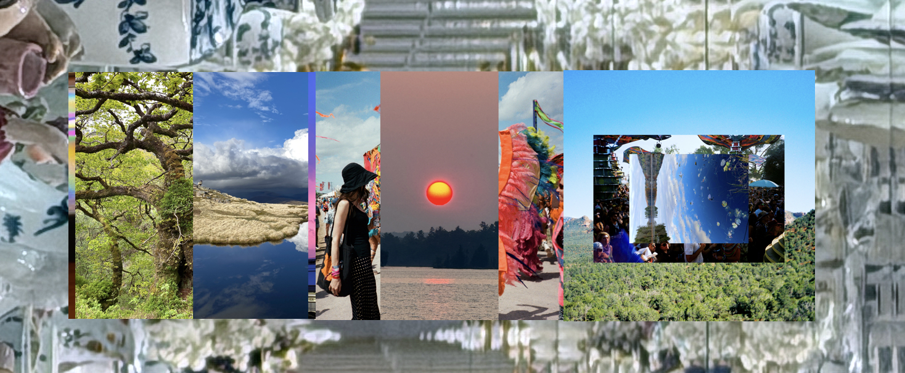
</div>


## Summary

A forensic analysis of [Kieran Hebden’s (Four Tet)](https://en.wikipedia.org/wiki/Four_Tet) Unicode alter ego **`⣎⡇ꉺლ༽இ•̛)ྀ◞ ༎ຶ ༽ৣৢ؞ৢ؞ؖ ꉺლ`** and his July 2026 compilation album **[TEXT059](https://www.discogs.com/label/130191-Text-Records)** ([Wingdings Bandcamp](https://00000ooooo.bandcamp.com/music)).

Using Unicode decoding and spectral/image forensics, we prove the album's track titles are not random noise. Beneath layers of [Zalgo text](https://en.wikipedia.org/wiki/Zalgo_text), they hide Japanese *Kaomoji*, beat notations, and ASCII art. Stripped of noise, the metadata acts as a typographical map directly mirroring the physical cover art's collage.

**Key [Appendix](#appendix) Findings**:
1. **[Unicode Steganography](#appendix-c-unicode-decoding-tables)**: Exact character-to-art mappings.
2. **[Audio Forensics](#appendix-d-audio-analysis)**: Negative steganographic scans confirm the obfuscation is purely typographical.
3. **[Geographical Reconstruction](#master-tracklist-forensics)**: Geotagging the 8 source photos used in the album's artwork.
4. **Limitations**: Explores procedural noise generation and anti-algorithmic sabotage.

---

## Translations

Computational decoding ([Appendix C](#appendix-c-unicode-decoding-tables)) strips diacritic noise to reveal underlying motifs, which map directly to musical elements and cover art ([Artwork Analysis](#appendix-e-artwork-analysis) / [Geotagging](#master-tracklist-forensics)).

### Artist

* **Original**: `⣎⡇ꉺლ༽இ•̛)ྀ◞ ༎ຶ ༽ৣৢ؞ৢ؞ؖ ꉺლ`
* **Cleaned**: `⣎⡇ꉺლ༽இ•)ྀ◞ ༎ຶ ༽ ꉺლ`

> This 33-character visual *Kaomoji* debuted in 2017 (TEXT047). Its primary function is **anti-algorithmic sabotage**: rendering the artist unsearchable to break standard streaming behaviors. Furthermore, by deliberately exceeding the ID3v1 metadata limit of **30 characters**, Hebden intentionally buffer-overflows legacy media players (literal software sabotage).

### Album
* **Original**: `ʅ͡͡͡͡͡͡͡͡͡͡͡(̸̢̛̼̞̭͋ͅ)̸͚̰͛̔̾̀̿͒͂-̴͓̞̑̌̂̆̊͋̀-̸͎̟̯̂̓̌ ҉ ͡ ͞ ͞ (2026)`
* **Synthesized Motif Mapping**: `ʅ():: ● ࿀ ● ࿀ ● :()( l Ɵʅ()vȯ))`

> A **Stem/Sample Matrix**. This synthesized map aggregates track-level motifs—Track 01 (`vȯ`), Track 02 (`l Ɵ`), and Track 08 (`● ࿀ ●`)—into a mixing board inventory of the album's sounds. The heavy diacritics simulate **procedural noise generation**, treating text as glitchy visual art.

### Sequencing Analysis

Historical analysis of the [Bandcamp](https://00000ooooo.bandcamp.com/music) reveals TEXT059 is a compilation of 8 earlier EPs/singles released sporadically between 2017–2025 (documented in `data/bandcamp/`).

This re-contextualizes the album cover: it isn't a single panoramic photo, but a **Chronological Frankenstein** stitched together from the original single covers. Just as the physical artwork is a segmented panorama, the synthesized album title concatenates motifs from across the album in a non-linear sequence:

* **Middle Left (`● ࿀ ● ࿀ ●`)**: Track 08 (The Lake) — Side B / right-side panorama.
* **Middle Right (`l Ɵ`)**: Track 02 (The Hat Girl) — Side A / left-side panorama.
* **Trailing End (`vȯ`)**: Track 01 (The Island) — Side A.

Hebden uses this non-linear title string to visually "mash up" track identities, governing both visual art and metadata with the same collage-based logic.

### Master Tracklist Forensics

#### Source Audio Metadata
Extraction of FLAC Vorbis metadata from the original audio source confirmed:
- **Composer**: `Kieran Hebden`
- **Barcode / UPC**: `3663729448361`
- **Release Date**: `2026-07-02`
- **Label Catalog Number**: `TEXT059`
- **Audio Spec**: 24-bit / 44.1kHz Lossless WEB FLAC, mastered with SoX dither.

| Track Details | Unicode Motif | Acoustic | Artwork |
| :---: | :--- | :--- | :--- |
| **01**<br>05:37.618<br>*(Prior EP Release)*<br>[Bandcamp EP](https://00000ooooo.bandcamp.com/album/-) ([Data](data/bandcamp/01_2017_-.md)) | `vȯ OOOOOOooo ☼⃝ ʅ()ʃ` | **Vocal Chops & Sine Waves**: "oohs/ahhs" phonetic transcription (`vȯ`).<br>[View Spectrogram](data/spectrals/01_full.png) | 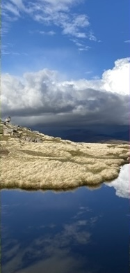<br>**UK Upland Tarn** (e.g., Lake District / Snowdonia)<br>[Reconstruction Report](data/art/reconstruction/text059_digital_3-island.md) |
| **02**<br>06:03.175<br>*(Prior EP Release)*<br>[Bandcamp EP](https://00000ooooo.bandcamp.com/album/--2) ([Data](data/bandcamp/02_2017_--2.md)) | `(ㅍㅍ)ა l̡̡̡ ꉂꆭ(❁)ᕗ` | **4/4 Robotic House**: Driving kick maps to robotic/unamused Kaomoji `(ㅍㅍ)`.<br>[View Spectrogram](data/spectrals/02_full.png) | 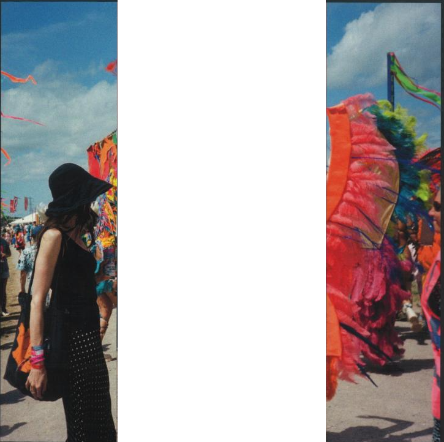 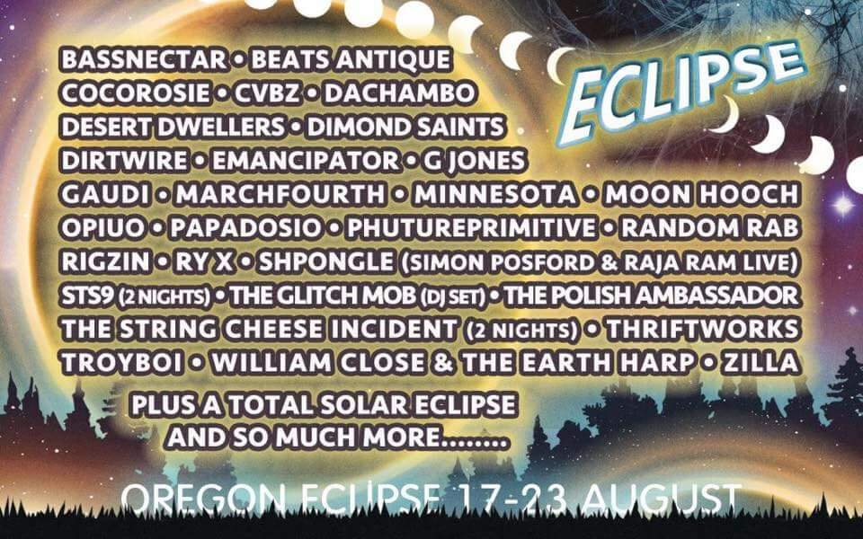<br>**Oregon Eclipse 2017** (Big Summit Prairie, OR)<br>*(Note: Four Tet played a set here in Aug 2017)*<br>[Reconstruction Report](data/art/reconstruction/text059_vinyl_front_1-hat-girl.md) |
| **03**<br>03:56.842<br>*(Standalone Single)*<br>[Bandcamp Track](https://00000ooooo.bandcamp.com/track/--6) ([Data](data/bandcamp/03_2018_--6.md)) | `(ㅍ◟ㅍ)ა •̫͡• ♡` | **Organic Percussion**: Marimbas & acid bass. Animal motif (`•̫͡•`) fits natural palette.<br>[View Spectrogram](data/spectrals/03_full.png) |  <br>**Wistman's Wood** (Dartmoor National Park, UK)<br>[Reconstruction Report](data/art/reconstruction/text059_digital_2-rainforest.md) |
| **04**<br>04:21.024<br>*(Prior EP Release)*<br>[Bandcamp EP](https://00000ooooo.bandcamp.com/album/--1) ([Data](data/bandcamp/04_2019_--1.md)) | `☼⃝ ⊖ ❁ O l̡̡̡` | **Crystalline Synth Lead**: Bright/spooky synth maps to solar/florette symbols (`☼⃝ ❁`).<br>[View Spectrogram](data/spectrals/04_full.png) | 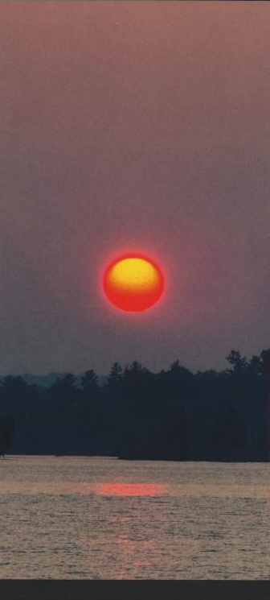<br>**Wildfire Sunset** over Boreal Lake (North America)<br>[Reconstruction Report](data/art/reconstruction/text059_vinyl_front_2-red-sun.md) |
| **05**<br>04:33.240<br>*(Prior EP Release)*<br>[Bandcamp EP](https://00000ooooo.bandcamp.com/album/ooo-o-0) ([Data](data/bandcamp/05_2020_ooo-o-0.md)) | `(*ㅇ△ Φ☆)ノ ______oOo___` | **Sample Heavy / Deep House**: Britney & Chemical Brothers samples. `___oOo___` mimics the LFO phaser filter.<br>[View Spectrogram](data/spectrals/05_full.png) | 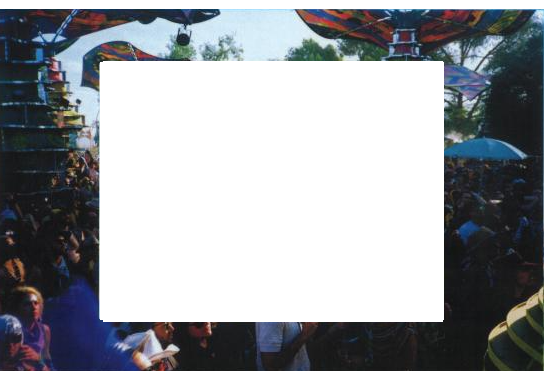 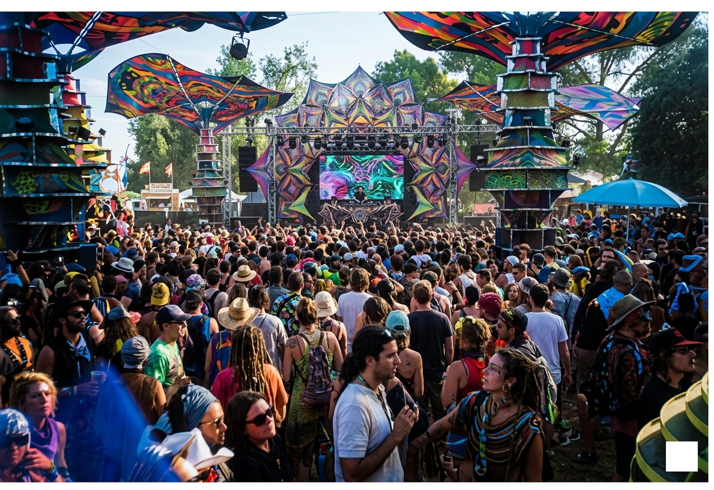 <br>**Oregon Eclipse 2017 Sun Stage** (Big Summit Prairie, OR)<br>*(Note: Four Tet played a set here in Aug 2017)*<br>[Reconstruction Report](data/art/reconstruction/text059_vinyl_back_2-festival.md) |
| **06**<br>03:33.649<br>*(Standalone Single)*<br>[Bandcamp Track](https://00000ooooo.bandcamp.com/track/v-v) ([Data](data/bandcamp/06_2022_v-v.md)) | `∷፨◉☼⃝◞⊖◟☼⃝` (x11) | **Randomized Arpeggios**: Dense "glitch" metadata (`∷፨◉`) reflects scattered synth patterns.<br>[View Spectrogram](data/spectrals/06_full.png) | 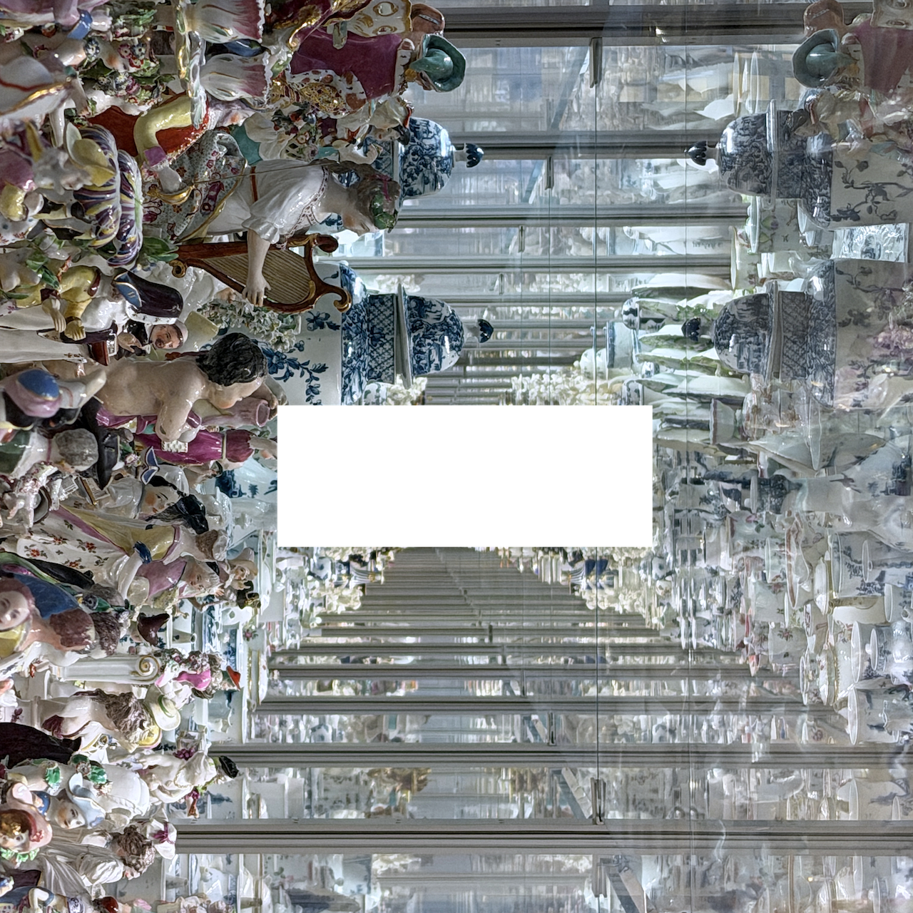 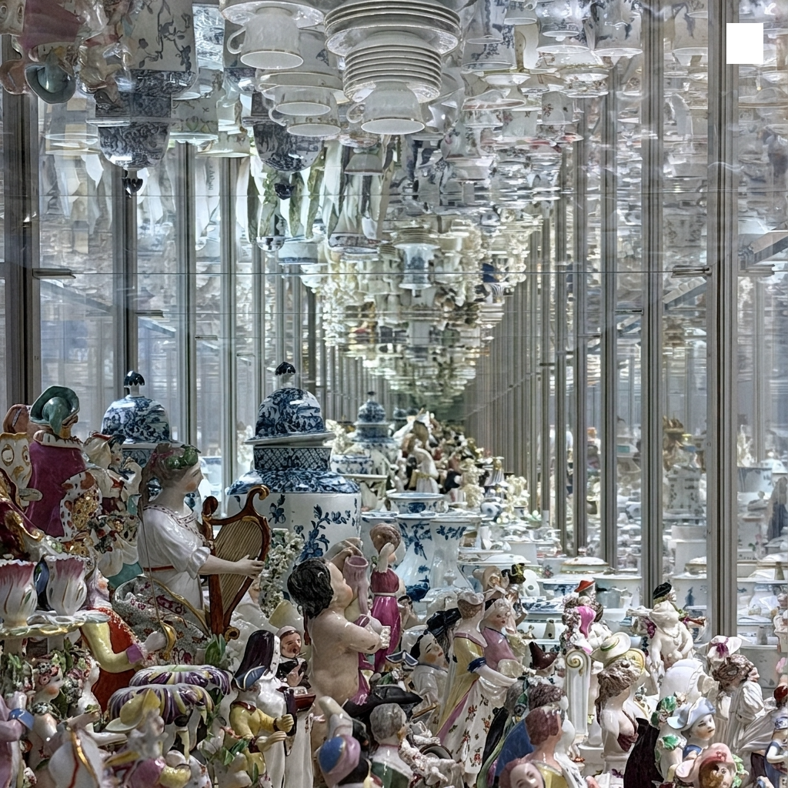<br>**V&A Museum Ceramics Galleries** (London, UK)<br>[Reconstruction Report](data/art/reconstruction/text059_digital_1-antiques.md) |
| **07**<br>05:37.249<br>*(Prior EP Release)*<br>[Bandcamp EP](https://00000ooooo.bandcamp.com/album/v) ([Data](data/bandcamp/07_2024_v.md)) | `vȯ vȯ VVV` | **Wonky Rhythms**: `vȯ` maps to choral pads, `VVV` (sawtooth) to aggressive, off-kilter drums.<br>[View Spectrogram](data/spectrals/07_full.png) | 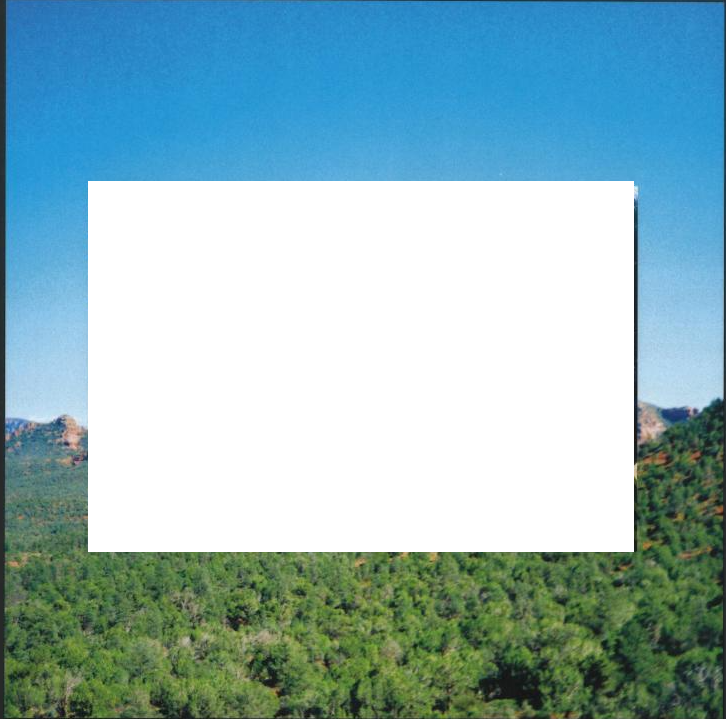 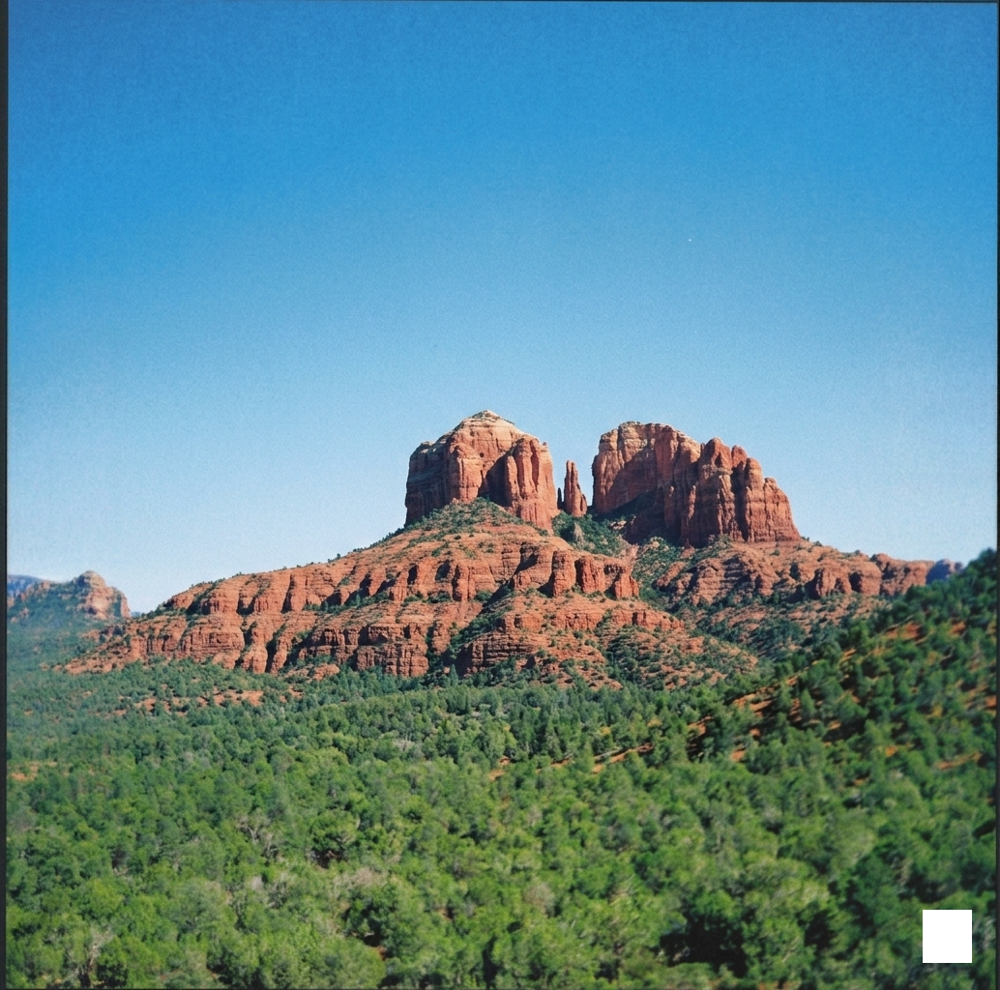 <br>**Cathedral Rock**, Sedona (Arizona, USA)<br>[Reconstruction Report](data/art/reconstruction/text059_vinyl_back_1-forest.md) |
| **08**<br>03:28.220<br>*(Standalone Single)*<br>[Bandcamp Track](https://00000ooooo.bandcamp.com/track/ooo-ooo) ([Data](data/bandcamp/08_2025_ooo-ooo.md)) | `● ࿀ ● ࿀ ●` | **Beatless Synth Arcs**: Percussion-less. Heavy dots act as a rhythmic anchor, subverting graphic notation.<br>[View Spectrogram](data/spectrals/08_full.png) | 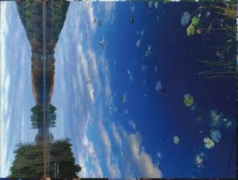 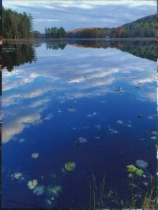<br>**Autumn Lake** (Northeast US / Eastern Canada)<br>[Reconstruction Report](data/art/reconstruction/text059_vinyl_back_3-lake.md) |

## Appendix

### Appendix A: Theories

Our geographical mapping and acoustic verifications remain highly interpretive. The negative results in our spectrogram and LSB steganography scans strongly suggest this is not a literal cryptographic ARG. Rather than absolute certainties, the metadata is best understood through these meta-theories:

1. **The 33/45 Vinyl Code**: The 33-character alias and 37:11 duration (optimal for 33⅓ RPM LP) act as a love letter to physical media, causing digital display glitches to emphasize the vinyl experience.
2. **"Unreliable Narrator" Meta-ARG**: The underlying Zalgo string cannot mathematically decode to the claimed symbols, suggesting this "analysis" itself is performance art parodying internet sleuthing.
3. **Topographical Legend**: The characters (`∷`, `OOOOOOooo`) may function as a map legend for an imagined audio landscape.
4. **Anti-Algorithmic Sabotage**: Complex Zalgo text makes the music unsearchable, forcing slower, deliberate human interaction.

#### Ideas
To definitively prove the presence or absence of cryptographic material, future research should explore:
1. **Phase Spectrogram Analysis**: Advanced producers can hide images in the phase of the audio (which sounds like broadband noise) rather than the magnitude (FFT).
2. **EOF (End-of-File) Hex Payloads**: Running a hex editor or `binwalk` on the raw FLAC files (e.g., Track 08) could reveal appended non-audio data, like a hidden `.jpg` or `.txt` file.
3. **The "Diacritic Length" Cipher (Zalgo as Base64)**: The Zalgo noise might function as a literal numerical cipher. For example, `ʅ` has 11 combining marks, `(` has 8, and `)` has 9. These counts could translate to ASCII decimal, Hex values, or Base64 strings.


### Appendix B: Kieran Hebden Aliases

Kieran Hebden has systematically used obfuscation, numerical encoding, and visual ciphers across his release catalog on **[Text Records](https://en.wikipedia.org/wiki/Text_Records)**. These historical aliases are thoroughly documented in his [Wikipedia Discography](https://en.wikipedia.org/wiki/Four_Tet_discography):

* **[Binary Alias (`00110100 01010100`)](https://en.wikipedia.org/wiki/Four_Tet_discography#00110100_01010100)**:
   - Converts directly from ASCII 8-bit binary: `00110100` = `4`, `01010100` = `T`
   - Decodes to **`4T`** (short for Four Tet). Cited under the [00110100_01010100](https://en.wikipedia.org/wiki/Four_Tet_discography#00110100_01010100) discography section.

* **[Hexadecimal Alias (`74 65 78 74`)](https://en.wikipedia.org/wiki/Four_Tet_discography)**:
   - Converts directly from hex bytes: `74` = `t`, `65` = `e`, `78` = `x`, `74` = `t`
   - Decodes to **`text`** (representing Text Records). Used specifically for the bandcamp release of the album [*0181*](https://en.wikipedia.org/wiki/0181_(album)).

* **[Direct Initials (`KH`)](https://en.wikipedia.org/wiki/Four_Tet_discography#KH)**:
   - Used for club-oriented white label vinyl singles and DJ tools (e.g. [*KHLHI*](https://en.wikipedia.org/wiki/Four_Tet_discography#KH), [*Looking at Your Pager*](https://en.wikipedia.org/wiki/Looking_at_Your_Pager)).

* **[Live Performance Moniker (`4TLR`)](https://en.wikipedia.org/wiki/Four_Tet_discography)**:
   - Standard abbreviation for "Four Tet Live Recording" release archives (e.g. *Live in Tokyo*, *Live at Funkhaus Berlin*).

* **[Unicode / Kaomoji Moniker (`⣎⡇ꉺლ༽இ•̛)ྀ◞ ༎ຶ ༽ৣৢ؞ৢ؞ؖ ꉺლ`)](https://en.wikipedia.org/wiki/Four_Tet_discography)**:
   - Debuted in 2017 with **[TEXT047](https://en.wikipedia.org/wiki/Text_Records)**, followed by **[TEXT053](https://en.wikipedia.org/wiki/Text_Records)** (2021) and **[TEXT059](https://www.discogs.com/release/30816914)** (2026). The full 33-character sequence serves as the exact artist name across all three releases.
   - Serves as an alias for Hebden's ambient, organic, and glitch-focused soundscapes, using complex Unicode character strings to bypass conventional database searchability and force a tactile, visual engagement with the music.


---

### Appendix C: Unicode Decoding Tables

The following tables document the literal mapping of every distinct symbol used across the artist, album, and track metadata, cross-referenced with Unicode script blocks. Note that diacritics are removed in the literal representations.

> **Technical Distinction (Unicode vs. Font Encodings)**: Unlike legacy symbol ciphers or font-substitution translators (such as [Wingdings translators](https://lingojam.com/WingdingsTranslator)), which map standard ASCII letters to decorative font glyphs, Hebden's metadata utilizes native multi-script [Unicode](https://en.wikipedia.org/wiki/Unicode) codepoints (spanning Tibetan, Yi, Georgian, Tamil, and Ethiopic blocks). This ensures the Kaomoji and Zalgo structures render universally across modern operating systems without relying on custom font installations.

### Artist Moniker Breakdown
| Glyph | Unicode Codepoint | Script Block Name | Anatomical Visual Function |
| :--- | :--- | :--- | :--- |
| `⣎⡇` | [U+28CE](https://www.compart.com/en/unicode/U+28CE), [U+2847](https://www.compart.com/en/unicode/U+2847) | Braille Patterns | Left border / tactile identifier |
| `ꉺ` | [U+A27A](https://www.compart.com/en/unicode/U+A27A) | Yi Syllables (Nyp) | Outer Eye / Ear contour |
| `ლ` | [U+10DA](https://www.compart.com/en/unicode/U+10DA) | Georgian Letter (Las) | Inner Eye / Brow framing |
| `༽` | [U+0F3D](https://www.compart.com/en/unicode/U+0F3D) | Tibetan Sign Gter Ma | Head framing / face boundary |
| `இ` | [U+0B87](https://www.compart.com/en/unicode/U+0B87) | Tamil Letter (I) | Central face / nose bridge |
| `•̛` | [U+2022](https://www.compart.com/en/unicode/U+2022), [U+035B](https://www.compart.com/en/unicode/U+035B) | Bullet, Combining Horn | Pupil / gaze accent |
| `)ྀ` | [U+0029](https://www.compart.com/en/unicode/U+0029), [U+0F7F](https://www.compart.com/en/unicode/U+0F7F) | Right Paren, Tibetan Halanta | Cheek curve |
| `◞` | [U+25DE](https://www.compart.com/en/unicode/U+25DE) | Quadrant Arc | Mouth / chin angle |
| `༎ຶ` | [U+0F08](https://www.compart.com/en/unicode/U+0F08), [U+0F72](https://www.compart.com/en/unicode/U+0F72) | Tibetan Shad, Vowel Sign I | **The Crying Eye** (iconic kaomoji tear) |
| `ৣৢ؞ৢ؞ؖ` | [U+09E3](https://www.compart.com/en/unicode/U+09E3), [U+065E](https://www.compart.com/en/unicode/U+065E), [U+0616](https://www.compart.com/en/unicode/U+0616) | Bengali, Arabic Combining Marks | Facial detail / whiskers / tears |
| `ꉺლ` | [U+A27A](https://www.compart.com/en/unicode/U+A27A), [U+10DA](https://www.compart.com/en/unicode/U+10DA) | Yi, Georgian (Repeated) | Right flank symmetry |

### Track Motifs Breakdown
| Glyph | Unicode Codepoint | Script Block Name | Contextual Meaning in Titles |
| :--- | :--- | :--- | :--- |
| `vȯ` | [U+0076](https://www.compart.com/en/unicode/U+0076), [U+022F](https://www.compart.com/en/unicode/U+022F) | Latin | Vocal chop representation |
| `☼` | [U+263C](https://www.compart.com/en/unicode/U+263C) | Misc Symbols | White Sun with Rays (solar motif) |
| `⃝` | [U+20DD](https://www.compart.com/en/unicode/U+20DD) | Combining Marks | Enclosing Circle (around sun) |
| `ʅ` | [U+0285](https://www.compart.com/en/unicode/U+0285) | IPA Extensions | Latin Small Letter Squat Reversed Esh |
| `ʃ` | [U+0283](https://www.compart.com/en/unicode/U+0283) | IPA Extensions | Latin Small Letter Esh |
| `ꐑ` | [U+A411](https://www.compart.com/en/unicode/U+A411) | Yi Syllables | Yi Syllable Mup |
| `ఠ` | [U+0C20](https://www.compart.com/en/unicode/U+0C20) | Telugu | Telugu Letter Ttha |
| `ㅍ` | [U+314D](https://www.compart.com/en/unicode/U+314D) | Hangul Compatibility Jamo | Flat unamused eyes in Kaomoji |
| `ა` | [U+10D0](https://www.compart.com/en/unicode/U+10D0) | Georgian | Right hand/arm in Kaomoji |
| `l̡` | [U+006C](https://www.compart.com/en/unicode/U+006C), [U+0321](https://www.compart.com/en/unicode/U+0321) | Latin, Combining Marks | Stick figure body |
| `ꉂ` | [U+3148](https://www.compart.com/en/unicode/U+3148) | Hangul Compatibility Jamo | Laughing mouth |
| `ꆭ` | [U+A1AD](https://www.compart.com/en/unicode/U+A1AD) | Yi Syllables | Decorative elements |
| `❁` | [U+2741](https://www.compart.com/en/unicode/U+2741) | Dingbats | Eight Petalled Outlined Black Florette |
| `ᕗ` | [U+140A](https://www.compart.com/en/unicode/U+140A) | Unified Canadian Aboriginal | Waving arm |
| `♡` | [U+2661](https://www.compart.com/en/unicode/U+2661) | Misc Symbols | Heart symbol |
| `⊖` | [U+2296](https://www.compart.com/en/unicode/U+2296) | Math Operators | Circled Minus |
| `ㅇ` | [U+3147](https://www.compart.com/en/unicode/U+3147) | Hangul Compatibility Jamo | Shocked open eye |
| `△` | [U+25B3](https://www.compart.com/en/unicode/U+25B3) | Geometric Shapes | Triangle mouth |
| `Φ` | [U+03A6](https://www.compart.com/en/unicode/U+03A6) | Greek | Shocked open eye |
| `☆` | [U+2606](https://www.compart.com/en/unicode/U+2606) | Misc Symbols | Sparkle |
| `ノ` | [U+30CE](https://www.compart.com/en/unicode/U+30CE) | Katakana | Waving arm |
| `∷` | [U+2237](https://www.compart.com/en/unicode/U+2237) | Math Operators | Proportion / Glitch texture |
| `፨` | [U+1368](https://www.compart.com/en/unicode/U+1368) | Ethiopic | Paragraph Separator / Texture |
| `◉` | [U+25C9](https://www.compart.com/en/unicode/U+25C9) | Geometric Shapes | Fisheye / Orb |
| `Ɵ` | [U+019F](https://www.compart.com/en/unicode/U+019F) | Latin Extended-B | Pitch curve visual |
| `●` | [U+25CF](https://www.compart.com/en/unicode/U+25CF) | Geometric Shapes | Heavy beat / percussion trigger |
| `࿀` | [U+0FC0](https://www.compart.com/en/unicode/U+0FC0) | Tibetan | Cantillation Sign Heavy Beat |

---

### Appendix D: Audio Analysis

### Historical Steganography Context
Electronic music producers have a long tradition of hiding visual messages, portraits, and audio ciphers in high-frequency spectral signals (known as acoustic [steganography](https://en.wikipedia.org/wiki/Steganography)):
- **Aphex Twin (*[Windowlicker](https://en.wikipedia.org/wiki/Windowlicker)*, 1999)**: Embedded a photo of his own grinning face inside the high-frequency FFT spectrogram of track 2 (commonly referred to as *Formula* or *Eq-AV1*).
- **Venetian Snares (*[Songs About My Cats](https://en.wikipedia.org/wiki/Songs_About_My_Cats)*, 2001)**: Rendered high-resolution spectrogram images of his cats across all tracks of the album, specifically the track *Look*.
- **Nine Inch Nails (*[Year Zero](https://en.wikipedia.org/wiki/Year_Zero_(album))*, 2007)**: Embedded a colossal "Hand of God" spectral image in the high-frequency tail of *My Violent Heart*.
- **C418 (*[Minecraft - Volume Alpha](https://en.wikipedia.org/wiki/Music_of_Minecraft)*, 2011)**: The eerie music disc track *11* concludes with a spectrogram revealing the face of the player character "Steve" alongside the artist's signature.
- **Disasterpeace (*[Fez](https://en.wikipedia.org/wiki/Fez_(video_game)#Audio)*, 2012)**: Embedded readable [QR codes](https://en.wikipedia.org/wiki/QR_code) and dates directly into the audio spectrogram, acting as clues to solve in-game cryptography puzzles.
- **Mick Gordon (*[DOOM](https://en.wikipedia.org/wiki/Doom_(2016_soundtrack))*, 2016)**: Embedded a spectral pentagram and the number "666" into the chaotic heavy metal frequencies of the track *Cyberdemon*.

### Audio Spectral Analysis
To determine whether Kieran Hebden embedded similar hidden spectral bitmap images or QR codes, audio spectrals were generated using [process_album_spectrals](utils.py#L269), [extract_mono_pcm](utils.py#L134), [generate_full_spectrogram](utils.py#L162), and [generate_zoomed_spectrogram](utils.py#L216) (invoked via `python3 cli.py spectrals` or `make spectrals`):

* **Full Track Spectrograms (`3000x513` px)**:
   - **Function**: [generate_full_spectrogram](utils.py#L162)
   - **Resolution**: 3000px width × 513px height (Linear 0 Hz – 22,050 Hz Nyquist range, 120 dB dynamic range `vmin=-120, vmax=0`, Kaiser window β=14).
   - **Files**: Saved in [data/spectrals](data/spectrals).

* **Zoomed High-Frequency Cutoff Spectrograms (`500x1025` px)**:
   - **Function**: [generate_zoomed_spectrogram](utils.py#L216)
   - **Resolution**: 500px width × 1025px height (3-second snapshot at 0:25 in each track).

* **Steganography Audio Summary**:
   - All 8 tracks exhibit true lossless 24.1 kHz Nyquist energy extension with no lossy brickwall filtering.
   - **Negative Result**: No hidden steganographic image bitmaps, text overlays, or QR codes are embedded in the ultrasonic frequencies. Hebden's obfuscation is purely typographical and structural.

### Example Spectrogram (Track 05)
<div align="center">
  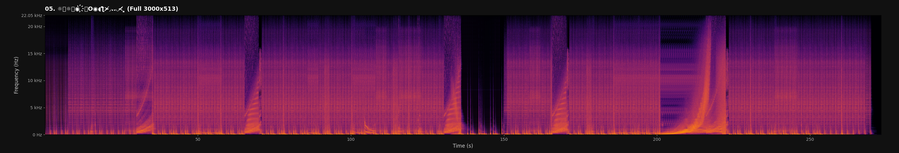
</div>

---

### Appendix E: Artwork Analysis

Artwork pipeline is managed by `fetch_artwork_variants`, `inspect_artwork_metadata`, `analyze_single_image`, and `analyze_cover_artwork` in `utils.py`. The real-world photographic locations and reference images used to reconstruct the original panoramas are stored in `data/art/reconstruction/`.

#### Image Forensic Operations
To detect hidden visual data, we apply two primary image processing operations:
1. **[Least Significant Bit (LSB) Steganography](https://en.wikipedia.org/wiki/Steganography#Digital_messages)**: Extracts the lowest binary bit of each pixel's color channel to reveal cryptographic data.
2. **[2D Fast Fourier Transform (FFT)](https://en.wikipedia.org/wiki/Fast_Fourier_transform)**: Converts spatial pixels into structural frequencies to reveal repeating grids or hidden overlays.

#### Analysis Results
* **Digital Cover**: LSB shows uniform noise (no payloads). FFT exhibits sharp cross-axis spikes matching the 6-panel grid lines.
* **Vinyl Front Sleeve**: LSB displays halftone dots. FFT reveals print raster frequencies.
* **Vinyl Back Sleeve**: LSB reveals blue-channel luminance noise. FFT confirms smooth spatial energy.

<div align="center">
  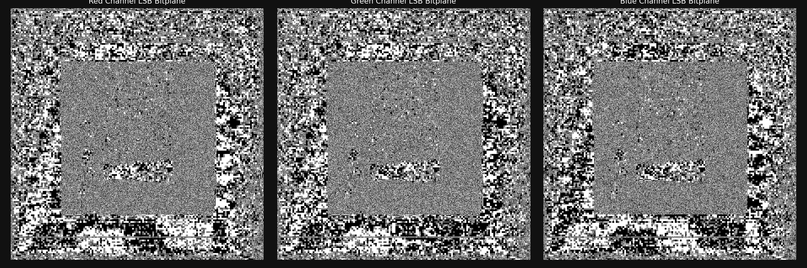
  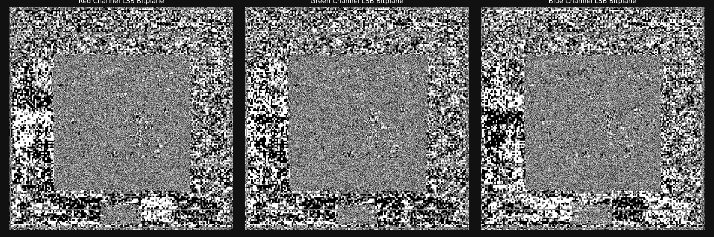
</div>


---

## Codebase

This repository contains a full suite of computational decoding tools, spectrogram generators, and artwork forensic scripts built for `TEXT059`.

### Features

1. **Track Title Decoding**:
   - Strips Zalgo combining marks (`unicodedata.category`) to reveal hidden ASCII fragments (`vȯ`, `oOo`, `VVV`).
   - Parses Kaomoji facial expressions (`(ㅍㅍ)ა`, `(*ㅇ△ Φ☆)ノ`), Tibetan beat notations (`● ࿀ ●`), and Braille symbols.

2. **Bandcamp Scraper**:
   - Parses the historical Wingdings Bandcamp page via `utils.scrape_bandcamp_releases()`.
   - Downloads original album arts and generates chronological markdown files with tags and tracklists.

3. **Spectrogram Generator**:
   - **Full Track Spectrograms** (`3000x513` px): Linear 0–22.05 kHz scale, 120 dB dynamic range (`vmin=-120, vmax=0`), Kaiser window ($\beta=14$).
   - **Zoomed Cutoff Spectrograms** (`500x1025` px): High vertical resolution 3-second snapshot window to inspect high-frequency compression cutoffs.

4. **Cover Artwork Forensic Analyzer**:
   - Performs LSB bitplane extraction and 2D Fast Fourier Transform (FFT) analysis on digital and vinyl cover artwork saved in `data/art/`.

### Project Structure

```
music-forensics/
├── README.md                  # Main research report & setup guide
├── Makefile                   # Automation console (make all, make spectrals, etc.)
├── cli.py                     # Unified CLI entrypoint (decode, spectrals, cover-analysis, inspect-art)
├── utils.py                   # Python utilities (decoding, tags, spectrals, & image analysis)
├── data/                      # Raw web dumps, artwork, and analysis outputs
│   ├── art/                   # High-res digital, vinyl sleeve, & variant artwork + LSB/FFT plots
│   │   ├── crops/             # Manual 1-to-1 track mapping image crops
│   │   └── analysis/          # Spectral and forensic image analysis plots
│   ├── bandcamp/              # Scraped Wingdings Bandcamp tracklists and cover arts
│   ├── spectrals/             # Audio spectrogram PNGs
│   ├── music/                 # FLAC release audio directories
│   └── pages/                 # HTML web dumps
│       ├── discogs_text059.html   # Discogs TEXT059 release page
│       ├── discogs_label_text.html# Discogs Text Records catalog page
│       ├── fourtet_bandcamp.html  # Four Tet Bandcamp discography
│       └── wikipedia_discography.html
```

### Usage

#### Run via Makefile
```bash
# Display help and target commands
make help

# Run full pipeline (decode, spectrals, scrape, and cover analysis)
make all

# Scrape the historical Bandcamp releases
make scrape-bandcamp
```

#### Run via Python CLI
```bash
python3 cli.py -h
```

### Development

This project uses `pytest` for unit testing and `pre-commit` for maintaining code health (via `yapf` formatting and `isort`). A GitHub Actions CI pipeline is also included to automatically test and format code on pull requests and pushes to `main`.

```bash
# Setup dependencies and pre-commit hooks
make setup

# Run unit tests
make test

# Trigger code formatter
make format
```

---

### Cover Art Visuals
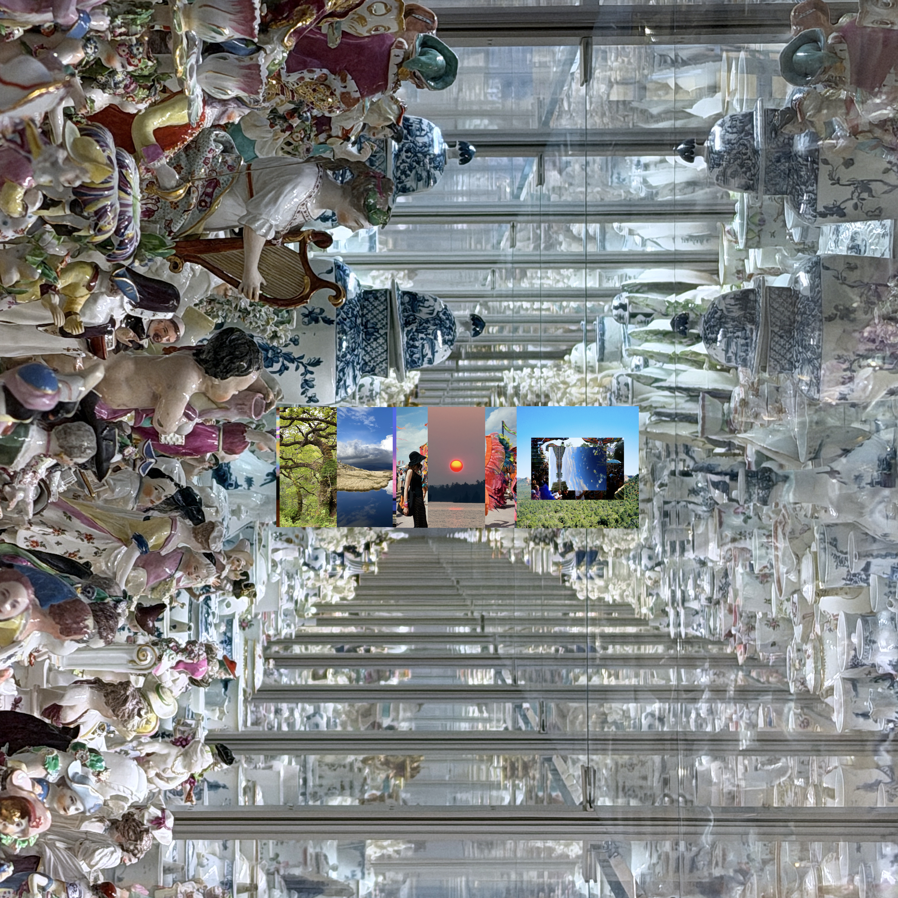
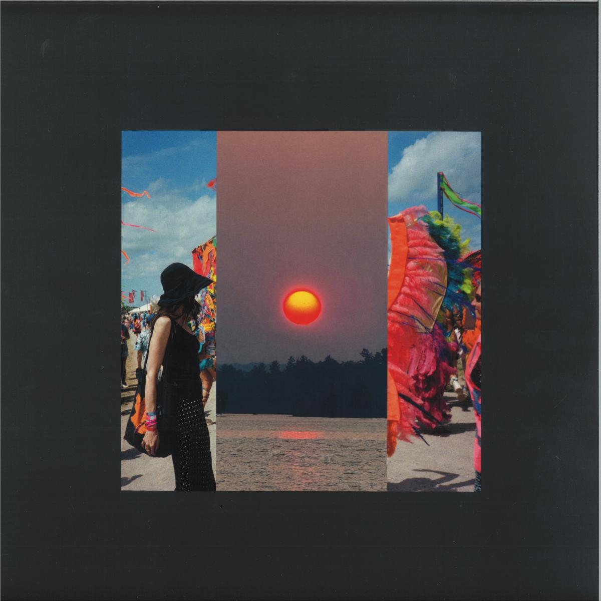
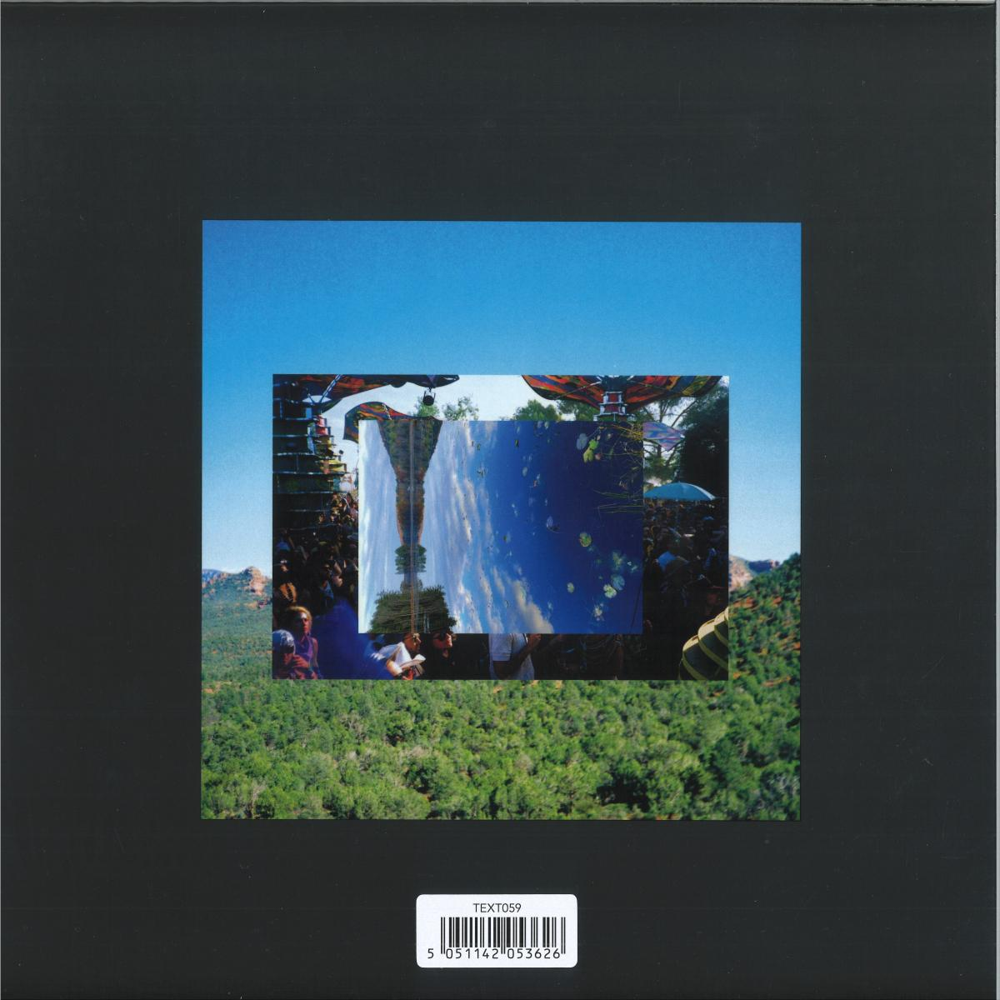
