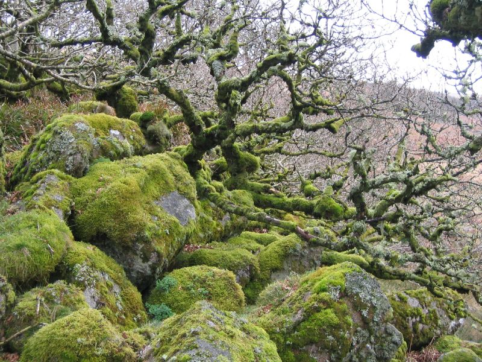

### Geographical Analysis and Location Details: The Twisted Forest

This analysis covers the rainforest crop (`text059_digital_2-rainforest.jpeg`).

* **Most Likely Location:** **[Wistman's Wood](https://en.wikipedia.org/wiki/Wistman%27s_Wood)**, Dartmoor National Park, Devon, England.

### Visual Evidence
* **Gnarled Oak Canopy:** Stunted pedunculate oak trees with contorted, twisting branches caused by high-altitude moorland winds.
* **Epiphytic Vegetation:** Trunks, branches, and granite boulder fields ("clatter") heavily carpeted in thick mosses, lichens, and ferns characteristic of an ancient temperate rainforest.

### Eliminated Alternatives
* **Puzzlewood (Forest of Dean, UK):** Features mossy ancient trees and paths, but geology consists of deep iron ore caves ("scowles") and ravines rather than open hillside granite boulder fields.
* **Hoia Baciu Forest (Romania):** Features strangely curved trees, but lacks the dense temperate rainforest moss and granite boulder ground cover.

### Conclusion
The unique combination of granite boulder fields and extremely stunted, moss-draped oak trees represents the geological and ecological signature of [Wistman's Wood](https://en.wikipedia.org/wiki/Wistman%27s_Wood) in Dartmoor.

---

### Images & Visual Context

#### Album Crop Piece

#### Location Reference Photograph

